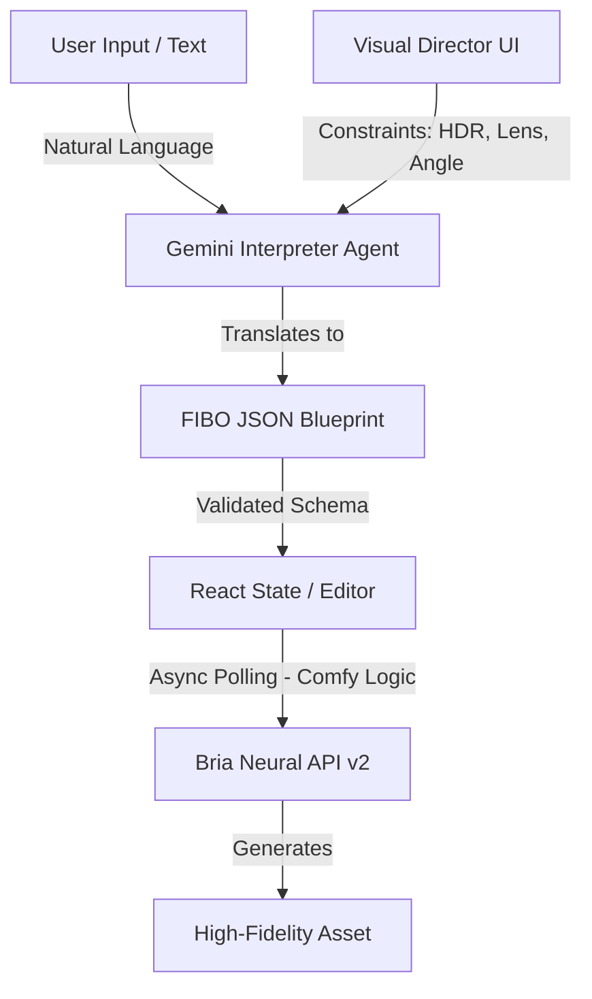

# 🚀 FIBO Studio OS

### Agentic, JSON-Native Visual Production System
**Hackathon Submission: Bria AI & FIBO Challenge**

 

---

## 📖 About The Project

**FIBO Studio OS** is a professional visual production environment that shifts the paradigm from "prompt guessing" to **deterministic engineering**. 

Instead of struggling with vague natural language prompts, this application uses an intelligent **Interpreter Agent** (powered by Gemini) to translate creative intent into **FIBO JSON Blueprints**. These blueprints provide pixel-perfect control over camera angles, lighting, color depth, and composition before they are sent to the Bria generation engine.

---

## 🚀 Deployment (Vercel)

1. **Fork/Clone** this repository to your GitHub.
2. **Import** the project in Vercel.
3. In the **Environment Variables** section, add the following keys:

| Key | Description |
| :--- | :--- |
| `API_KEY` | Your Google Gemini API Key |
| `BRIA_API_KEY` | Your Bria AI Production API Key |
| `BRIA_MCP_API_KEY` | Your Bria AI MCP Key |

4. **Deploy**.

---

## 🏗️ Architecture & Workflow

The system operates on a strictly typed Agentic pipeline:



---

## 🧩 ComfyUI Node Integration

This project bridges the gap between web applications and node-based workflows by strictly adhering to the logic defined in **Bria's Official ComfyUI Nodes**.

| ComfyUI Node Reference | TypeScript Implementation | Logic Ported |
| :--- | :--- | :--- |
| **`GenerateImageNodeV2`** | `services/fiboService.ts` | Implements the **Async Polling** mechanism (`pollStatusUntilCompleted`) to handle long-running generation tasks without timeouts, mirroring the Python `poll_status_until_completed` utility. |
| **`RefineImageNodeV2`** | `services/fiboService.ts` | We replicate the generation logic by passing the `structured_prompt` and `model_version: "FIBO"`. **Note:** We use Gemini to architect the JSON blueprint, replacing the internal Bria refinement step with our own Agentic pipeline, then passing that strict JSON to the engine. |

**Code Location:**
The core integration logic is found in `services/fiboService.ts`. The `generateViaRestV2` function replicates the Python SDK flow:
1.  **POST** payload with `sync: false` to `/v2/image/generate`.
2.  Extract `status_url` from the response.
3.  **Poll** the status URL until the state is `COMPLETED`.
4.  Retrieve the final `image_url`.

---

## 🛠️ Resource Usage & Integration Details

### 1. FIBO (Foundation for Image generation via Bria Objects)
*   `types.ts`: Defines the TypeScript interfaces (`FiboScene`, `FiboObject`, `FiboLighting`) ensuring the app strictly adheres to the Bria schema.
*   `services/geminiService.ts`: Uses the `SCENE_SCHEMA` to force the LLM to output valid FIBO JSON.

### 2. Bria AI API (REST v2)
*   **Primary Generation Engine:** Used in `services/fiboService.ts` -> function `generateViaRestV2`.
*   **Why:** Highest fidelity and enterprise safety (indemnity).

### 3. Google Gemini (Interpreter Agent)
*   **The Brain:** Used in `services/geminiService.ts`.
*   **Model:** `gemini-2.5-flash` for speed and schema adherence.

### 4. Bria MCP (Model Context Protocol)
*   **Fallback Strategy:** Used in `services/fiboService.ts` -> function `generateViaMcp`.
*   **Function:** If the primary REST API fails, the system degrades gracefully to use the MCP endpoint via JSON-RPC.

---

## 💻 Local Setup Instructions

1.  **Clone the repository**
    ```bash
    git clone https://github.com/your-username/fibo-studio-os.git
    cd fibo-studio-os
    ```

2.  **Install Dependencies**
    ```bash
    npm install
    ```

3.  **Environment Configuration**
    Create a `.env` file in the root directory.
    
    ```env
    API_KEY=AIzaSy...
    BRIA_API_KEY=...
    BRIA_MCP_API_KEY=...
    ```

4.  **Run the Application**
    ```bash
    npm start
    ```

---

*Built with ❤️ for the Bria AI Hackathon.*